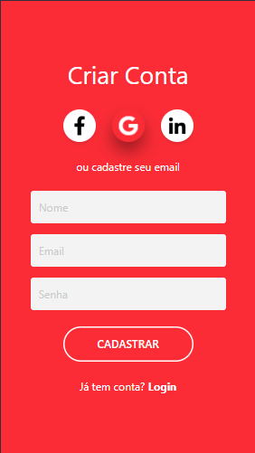

# 📘 Projeto 01 – Estudo Inicial com Tailwind CSS

<p align="center">
  
</p>

## 📌 Sobre o Projeto

Este projeto marca meu **primeiro contato prático com o Tailwind CSS**.

O objetivo **não era criar um sistema funcional**, mas sim:

- Testar classes utilitárias  
- Explorar estilização sem CSS tradicional  
- Entender a abordagem *utility-first*  
- Pesquisar e aplicar recursos diretamente da documentação oficial  

O layout desenvolvido foi uma **tela de criação de conta**, inspirada em um modelo base visual.

## 🎯 Objetivo Acadêmico

- Compreender a proposta do Tailwind  
- Trabalhar com CDN para testes rápidos  
- Aplicar estilização apenas com classes utilitárias  
- Experimentar efeitos de `hover`, sombras e transições  
- Desenvolver autonomia na leitura da documentação oficial  

## 🛠️ Tecnologias Utilizadas

- HTML5  
- Tailwind CSS (via CDN)

## 📂 Estrutura de Arquivos


```
mobile-cadastrar-tailwind
│
├── img/
│ ├── icon-facebook.webp
│ ├── icon-google.png
│ ├── icon-linkedin.png
│ ├── mobile-cadastrar-base.png
│ └── mobile-cadastrar-projeto.png
│
├── index.html
└── README.md
```

## 🧱 Principais Classes Utilizadas e Seus Significados

### 🎨 Layout Geral

| Classe | Significado |
|--------|------------|
| `bg-red-500` | Define cor de fundo vermelho padrão do Tailwind |
| `min-h-screen` | Altura mínima igual a 100% da altura da tela |
| `flex` | Ativa o Flexbox |
| `items-center` | Alinha itens verticalmente no centro |
| `justify-center` | Centraliza horizontalmente |


### 📦 Container Principal

| Classe | Significado |
|--------|------------|
| `w-full` | Largura total disponível |
| `max-w-xs` | Define largura máxima pequena |
| `text-center` | Centraliza o texto |
| `text-white` | Define texto branco |
| `px-4` | Padding horizontal |


### 🔤 Tipografia

| Classe | Significado |
|--------|------------|
| `text-4xl` | Tamanho grande de fonte |
| `text-base` | Tamanho padrão |
| `font-semibold` | Peso semi-negrito |
| `font-bold` | Peso negrito |

### 🧩 Espaçamentos

| Classe | Significado |
|--------|------------|
| `mb-8` | Margin-bottom grande |
| `mb-6` | Margin-bottom média |
| `mb-4` | Margin-bottom menor |
| `mt-6` | Margin-top |

### 🟢 Inputs

| Classe | Significado |
|--------|------------|
| `w-full` | Ocupa toda a largura disponível |
| `p-3` | Padding interno |
| `rounded` | Bordas arredondadas |
| `bg-[#F3F3F3]` | Cor personalizada hexadecimal |
| `text-[#A0A0A0]` | Cor personalizada de texto |
| `outline-none` | Remove contorno padrão ao focar |


### 🔘 Botão

| Classe | Significado |
|--------|------------|
| `w-48` | Largura fixa |
| `border-2` | Borda com espessura |
| `rounded-full` | Bordas totalmente arredondadas |
| `hover:bg-white` | Altera fundo no hover |
| `hover:text-red-500` | Altera cor do texto no hover |
| `transition` | Ativa transição suave |
| `duration-300` | Define duração da transição |

### 🟣 Ícones Sociais

| Classe | Significado |
|--------|------------|
| `w-14 h-14` | Largura e altura iguais |
| `rounded-full` | Formato circular |
| `shadow-md` | Sombra média |
| `hover:shadow-[...]` | Sombra personalizada no hover |
| `hover:invert` | Inverte cor da imagem |
| `cursor-pointer` | Cursor de clique |


## 🧠 Conceitos Praticados

- Utility-first CSS  
- Uso de cores padrão e personalizadas  
- Flexbox com Tailwind  
- Estados interativos (`hover:`)  
- Transições e sombras customizadas  
- Responsividade básica  

## 🖼️ Modelo Base do Professor

<p align="center">
  
</p>


O layout foi inspirado em um modelo visual de tela de cadastro apresentado com:

- Fundo vermelho sólido  
- Formulário centralizado  
- Botões sociais circulares  
- Botão principal com efeito de transição  

A proposta era reproduzir a estrutura visual utilizando exclusivamente classes do Tailwind.


## ▶️ Como Executar o Projeto

Siga os passos abaixo para executar corretamente:

### 1️⃣ Clonar o repositório

No terminal, execute:

```bash
git clone https://github.com/LucasAlexandreDev/moble-cadastrar-tailwind.git
 ```

Depois, acesse a pasta do projeto:
```
cd mobile-cadastrar-tailwind
```

### 2️⃣ Verificar a importação do Tailwind via CDN

No arquivo `index.html`, dentro da tag `<head>`, adicione o script abaixo:

```html
<script src="https://cdn.jsdelivr.net/npm/@tailwindcss/browser@4"></script>
```

⚠️ Este projeto utiliza o Tailwind via CDN, portanto é necessário estar conectado à internet.

### 3️⃣ Abrir o projeto no navegador

Você pode:

- Clicar duas vezes no arquivo index.html ou
- Abrir utilizando a extensão Live Server (caso esteja usando o VS Code)

## 📚 Fonte de Pesquisa

Toda a pesquisa de classes, utilidades e exemplos foi feita na documentação oficial:

🔗 https://tailwindcss.com/ 

## 🏁 Conclusão

Este projeto marcou meu primeiro contato prático com o Tailwind CSS e com a abordagem *utility-first*.

A experiência demonstrou como o framework agiliza a construção de layouts, exige organização nas classes e reforça a importância da documentação oficial no processo de desenvolvimento.

Embora simples e sem funcionalidades, o projeto cumpriu seu propósito: consolidar a base no uso do Tailwind e compreender sua aplicação na prática.

